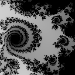

# T4: Geração de Fractais de Mandelbrot com MPI


## Introdução


Neste trabalho, você vai paralelizar um programa que gera uma sequência de imagens representando um "zoom" em um [fractal de Mandelbrot](https://en.wikipedia.org/wiki/Mandelbrot_set). A imagem ao lado foi gerada com esse programa.




## Preparação

1. Baixe o arquivo [fractal.zip](fractal.zip), que contém o programa sequencial de referência para este trabalho. Este programa foi desenvolvido pelo professor Martin Burtscher, da Texas State University (EUA).

2. Descompacte e compile o programa:
   ```
   unzip fractal.zip
   cd fractal
   g++ fractal.cpp -o fractal
   ```

3. Execute o programa para imagens de diferentes tamanhos e diferentes quantidades de frames:
   ```
   ./fractal 512 32
   ./fractal 512 64
   ./fractal 1024 32
   ./fractal 1024 64
   ```

4. **Atenção!** O programa só grava imagens em arquivo para imagens pequenas (<= 256) e poucos frames (<= 100). É recomendável gerar algumas imagens quando estiver testando seu programa paralelo, para verificar se estão sendo geradas corretamente. 

5. Caso você deseje gerar uma animação, pode usar, por exemplo, o seguinte comando do [ImageMagick](http://www.imagemagick.org):
   ```
   convert -delay 1x10 fractal1*.bmp fractal.gif
   ```


## Desenvolvimento


1. Observe como os parâmetros de entrada influenciam no tempo de execução do programa.

2. Analise o código e identifique oportunidades de paralelismo, considerando que a arquitetura paralela alvo seja um cluster.

3. Projete uma solução paralela para o problema e implemente um programa usando MPI. Coloque seu programa num arquivo nomeado `fractalpar.cpp`.

4. Analise o desempenho do programa, começando pela medição dos tempos de execução sequencial e paralela para diferentes entradas do programa: a) 1024 32, b) 1024 64 e c) à sua escolha. Varie o número de processos: 2, 4 e 8. Calcule speedup e eficiência para cada caso. 

5. Elabore slides descrevendo a estratégia de paralelização adotada, o ambiente de experimentação (dados da máquina local ou do cluster/nodes), os experimentos realizados e os resultados obtidos;

## Entrega

Este trabalho deve ser entregue **individualmente**, mas você pode trabalhar com colegas durante as aulas.

No repositório de entrega, crie um documento `Entrega.md`, contendo:
 - Identificação completa da disciplina e do aluno;
 - Link para o código desenvolvido: `fractalpar.cpp`;
 - Link para **slides** elaborados;
 - Referências.

Clique aqui para criar o repositório de entrega: https://classroom.github.com/a/TeGDJVa6


## Material de apoio

- [Projetando e Construindo Programas Paralelos](https://setrem.com.br/erad2019/data/pdf/minicursos/mc02.pdf)
- [Message Passing Interface (MPI)](https://computing.llnl.gov/tutorials/mpi/)  
  Tutorial do Lawrence Livermore National Laboratory (LLNL) sobre MPI.
